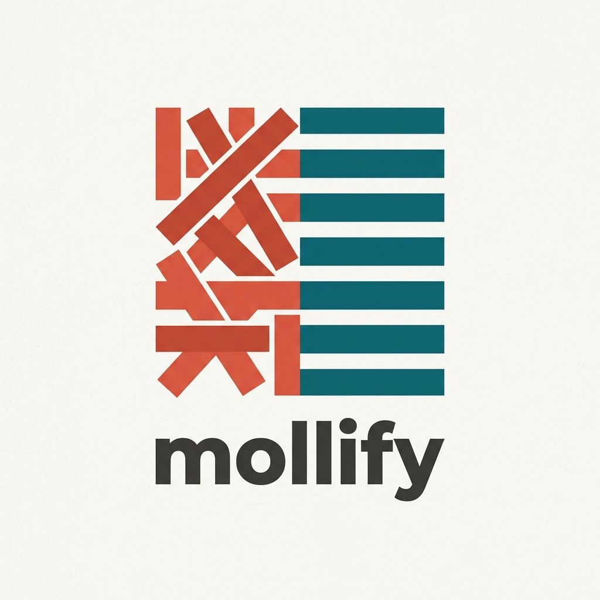

<div align="center">



**Deterministic codebase intelligence for Python.**

*Dead code · duplication · circular dependencies · complexity & hotspots · architecture · dependency hygiene · type health · security — as evidence, not guesses.*

[Usage](docs/usage.md) · [Cookbook](cookbook/) · [Configuration](docs/configuration.md) · [Architecture](docs/architecture.md) · [CI integration](docs/ci-integration.md) · [Agent integrations](#agent-integrations)

</div>

---

Mollify is a Rust-native engine that gives humans **and AI agents** a structured,
inspectable map of a Python codebase. It's [fallow](https://github.com/fallow-rs/fallow)'s
model — one fast binary that unifies the whole "what's unused / risky / duplicated /
tangled" question — ported to Python and extended with Python-specific signals
(type health, notebooks, framework awareness) that fallow doesn't have.

Its one rule: **no AI invents findings.** Every result is a piece of deterministic
evidence with a stable fingerprint, a confidence tier, and a human-readable reason.
Mollify *produces candidates*; you (or your agent) decide what to do with them.

> **Project status:** early but real. The core analysis phases are implemented,
> tested (100+ tests), and dogfooded; CI is green. See [`docs/adr/`](docs/adr)
> for design decisions and *Engineering notes* below for how it works.

## Why Mollify

<p align="center">
  
</p>

- **One tool, eight signals.** Most Python shops bolt together vulture + ruff +
  deptry + tach + radon + jscpd + bandit. Mollify runs the equivalent set in a
  single deterministic pass with one config and one output contract.
- **Built for coding agents.** A first-class MCP server plus shipped integrations
  for **Devin/Cascade, Claude Code, Codex, Cursor, and Gemini CLI** — so the
  agent reads repo *truth* instead of reconstructing it from `grep`.
- **Honest about uncertainty.** Python dead-code detection is undecidable in
  general, so every verdict is tiered `certain / likely / uncertain` and only
  `certain` findings are ever auto-fixed. Framework decorators (routes, tasks,
  fixtures, CLI commands, validators) are understood, killing the #1 false positive.
- **Deterministic & CI-ready.** Identical input → byte-identical output. SARIF,
  JSON, exit codes, and a PR-scoped `--gate new-only`.

## What it detects

<p align="center">
  
</p>

| Area | Command | Rules |
|---|---|---|
| **Dead code** | `mollify dead-code` | `unused-file`, `unused-export`, `unused-import`, `unused-variable`, `unused-parameter`, `unused-method`, `unused-attribute`, `unused-enum-member`, `unreachable-code`, `duplicate-export`, `commented-code` |
| **Dependency hygiene** | `mollify deps` | `unused-dependency`, `missing-dependency`, `transitive-dependency`, `misplaced-dev-dependency`, `unresolved-import` (pyproject + requirements/uv/pdm; venv-aware) |
| **Architecture** | `mollify arch` | `circular-dependency`, `layer-violation`, `forbidden-import`, `independence-violation`, `private-import`, custom policies |
| **Complexity & cohesion** | `mollify complexity` | `high-complexity`, `hotspot` (churn × complexity), `low-cohesion` (LCOM*) |
| **Duplication** | `mollify dupes` | `duplication` (clone families) |
| **Type health** | `mollify types` | `untyped-function`, `private-type-leak` |
| **Security** | `mollify security` | eval/exec, shell, `sql-injection`, weak hash/cipher, insecure-random, unsafe deserialization, TLS, secrets, missing-timeout, Flask debug, Jinja2 autoescape, broad `except: pass` — each with a CWE id |
| **Cold paths** | `mollify coverage --coverage-file` | `cold-code` (reachable but never executed) |
| **Supply chain** | `mollify supply-chain` | `vulnerable-dependency` (live OSV; offline DB fallback) |
| **Metrics** | `mollify metrics` | Maintainability Index, Halstead, raw LOC, per-file complexity |
| **Everything + score** | `mollify audit` | all of the above + a 0–100 quality score |

Plus `mollify graph [--mermaid]` (import-graph export), `mollify lsp` (editor
diagnostics), and `--format github|junit` for CI.

Also: **Jupyter notebooks (`.ipynb`)** are discovered and analyzed cell-by-cell;
**framework awareness** (Flask/FastAPI/Django/Celery/pytest/click/Pydantic/…);
**architecture presets** (`layered`/`hexagonal`/`feature-sliced`/`bulletproof`) and
**declarative rule packs** (ban imports/calls per path); `mollify fix` to safely
remove `certain` unused symbols; `mollify explain <rule>` for rule semantics; and
`mollify trace <module>` for a module's import neighborhood; `mollify inspect
<file>` for a per-file evidence bundle; `mollify list` for project topology; and
**regression baselines** (`--save-baseline` / `--baseline --fail-on-regression`)
to gate CI on *new* issues without git.

## Install

<p align="center">
  
</p>

**Python users (recommended) — via [uv](https://docs.astral.sh/uv/):**

```bash
uvx mollify audit              # one-off, isolated (no install)
uv tool install mollify        # persistent, puts `mollify` on your PATH
uvx mollify@latest audit       # pin/refresh to a specific version
```

**Or pip / npm / cargo:**

```bash
pip install mollify
npm install --save-dev mollify   # also: pnpm add -D / yarn add -D / bun add -d
# one-off: npx mollify audit ; MCP: npx mollify-mcp ; LSP: npx mollify-lsp
cargo install mollify-cli        # builds from crates.io (binary: mollify)
```

**From source (Rust):**

```bash
git clone https://github.com/FavioVazquez/mollify
cd mollify
cargo build --release          # binary at ./target/release/mollify
```

Every channel ships the **same self-contained binary** with the agent
integrations embedded: the PyPI wheel bundles the compiled binary (built with
[maturin](https://www.maturin.rs/)); the npm package pulls a prebuilt
`@mollify-cli/<platform>` binary; the crates.io build embeds the artifacts from
the in-crate `assets/`. Interactive
human runs print a one-line upgrade hint when a newer version is published;
machine formats, pipes, CI, and non-TTY agent paths never do. Set
`MOLLIFY_UPDATE_CHECK=off` (or `DO_NOT_TRACK=1`) to disable it.

### Install agent integrations

Scaffold the version-matched skills, rules, hooks, slash-commands, and
workflows for your agent straight into a repo (works however mollify was
installed):

```bash
mollify init --agent claude    # or: cursor / gemini / codex / cascade
mollify init --all             # every supported agent
mollify init --all --force     # overwrite existing files
```

## Quick start

<p align="center">
  
</p>

```bash
mollify audit --path /your/python/project
```

```text
Mollify audit — /your/project
Quality score: 84/100
12 finding(s) across 47 file(s) — 0 error, 12 warn
  src/app.py:6   [warn/certain]  unused-export — function `_legacy` has no reachable references  (unused-export:931a82e6)
  src/api.py:88  [warn/likely]   high-complexity — function `handle` is complex (cyclomatic 14, cognitive 19)  (high-complexity:1aa9…)
  src/db.py:1    [warn/certain]  circular-dependency — import cycle: db → models → db  (circular-dependency:7c…)
  pyproject.toml:1 [warn/likely] unused-dependency — declared dependency `rich` is never imported  (unused-dependency:93…)
```

Machine-readable + CI:

```bash
mollify audit --format json                       # kind-discriminated contract
mollify audit --format sarif > mollify.sarif      # GitHub/GitLab code scanning
mollify audit --gate new-only --base origin/main  # only fail on regressions
mollify fix                                        # preview safe removals (--apply to write)
```

Supply-chain (live OSV by default, offline fallback):

```bash
mollify supply-chain                 # query OSV.dev live for pinned versions
mollify supply-chain --refresh       # …and cache results to .mollify/advisories.json
mollify supply-chain --offline       # deterministic: local advisory DB only
# `mollify audit` stays offline — it folds in supply-chain from .mollify/advisories.json when present
python3 scripts/fetch-advisories.py .mollify/advisories.json   # seed/refresh the DB out-of-band
```

## Confidence tiers

| Tier | Meaning | Auto-fixable |
|---|---|---|
| `certain` | Provable (e.g. a private unused symbol, no dynamic dispatch in scope) | ✅ |
| `likely` | Strong static signal, small residual dynamic risk | — |
| `uncertain` | Public surface, or near `getattr`/`eval`/`importlib` | — |

## The JSON contract

Every command emits a `kind`-discriminated envelope (`schema_version` pinned by
agent skills). Clients switch on `kind` and iterate `findings[]`:

```json
{
  "kind": "audit", "schema_version": "0.1", "quality_score": 84,
  "summary": { "total": 12, "errors": 0, "warnings": 12, "files_analyzed": 47 },
  "findings": [{
    "fingerprint": "unused-export:931a82e6", "rule": "unused-export",
    "category": "dead-code", "severity": "warn", "confidence": "certain",
    "reason": "function `_legacy` has no reachable references in the project",
    "location": { "path": "src/app.py", "line": 6, "end_line": 7 },
    "actions": [{ "type": "remove-symbol", "auto_fixable": true,
                  "suppression_comment": "# mollify: ignore[unused-export]" }]
  }]
}
```

## Configuration — `.mollifyrc.json`

```json
{
  "severity": { "dead-code": "error", "duplication": "warn", "unused-dependency": "off" },
  "ignore": ["tests/", "migrations/"],
  "max_cyclomatic": 10,
  "max_cognitive": 15,
  "architecture": { "layers": ["api", "service", "domain", "infra"] },
  "policies": [
    { "id": "no-requests-in-domain", "forbid_import": "requests", "in_paths": ["domain/"], "severity": "error" }
  ]
}
```

Raise rules/categories to `error` to make CI (and agent hooks) **block**. Full
reference: [docs/configuration.md](docs/configuration.md).

## Agent integrations

<p align="center">
  
</p>

One MCP server (`mollify mcp`), many front-ends. Shipped, ready-to-commit artifacts:

| Agent | Artifacts |
|---|---|
| **Devin Desktop / Cascade** | `.devin/skills/mollify/`, `.devin/rules/mollify.md`, `.devin/hooks.v1.json` + `.windsurf/hooks.json`, `.windsurf/workflows/mollify-*.md` |
| **Claude Code** | `.mcp.json`, `.claude/skills/mollify/`, `.claude/commands/`, `.claude/settings.json` hooks |
| **Codex** | `AGENTS.md`, `.codex/config.toml`, `.agents/skills/mollify/` (portable) |
| **Cursor** | `.cursor/rules/mollify.mdc`, `.cursor/mcp.json`, `.cursor/commands/` |
| **Gemini CLI** | `GEMINI.md`, `.gemini/settings.json`, `.gemini/commands/mollify/` |

Scaffold any of these into a repo with `mollify init --agent <name>` (or `--all`) — see [Install agent integrations](#install-agent-integrations) above.

## Architecture

<p align="center">
  
</p>

A Cargo workspace; data flows parse → graph → engines → report:

`mollify-types` (JSON contract) · `mollify-parse` (Python parsing, ruff AST) ·
`mollify-graph` (module/symbol graph + reachability + cycles) · `mollify-core`
(the engines) · `mollify-cli` (`mollify`) · `mollify-mcp` (MCP server) ·
`mollify-lsp` (Language Server).

See [docs/architecture.md](docs/architecture.md).

## How it compares

<p align="center">
  
</p>

| | vulture | ruff | deptry | tach | radon | jscpd | bandit | **Mollify** |
|---|:-:|:-:|:-:|:-:|:-:|:-:|:-:|:-:|
| Whole-project dead code | ✅ | – | – | – | – | – | – | ✅ (reachability + tiers) |
| Unused class members / enum members | ✅ | – | – | – | – | – | – | ✅ |
| Unreachable code | ✅ | ~ | – | – | – | – | – | ✅ |
| Dependency hygiene (unused/missing/transitive) | – | – | ✅ | – | – | – | – | ✅ |
| Misplaced dev dependency | – | – | ✅ | – | – | – | – | ✅ |
| Unresolved / broken imports | – | ~ | – | – | – | – | – | ✅ |
| Circular deps | – | – | – | ✅ | – | – | – | ✅ |
| Boundaries / interface (private-import) | – | – | – | ✅ | – | – | – | ✅ |
| Complexity | – | ~ | – | – | ✅ | – | – | ✅ |
| Churn × complexity | – | – | – | – | – | – | – | ✅ |
| Duplication | – | – | – | – | – | ✅ | – | ✅ |
| Type health + private-type leaks | – | ~ | – | – | – | – | – | ✅ |
| Security candidates (+CWE) | – | ~ | – | – | – | – | ✅ | ✅ |
| One deterministic pass + agent/MCP contract | – | – | – | – | – | – | – | ✅ |

`~` = partial. Mollify's wedge is the **unified deterministic pass** with one
contract — individual tools each already do a piece well; Mollify unifies them
into a single evidence stream.

## Engineering notes

<div align="center">
  
</div>

Mollify is built to be precise and dependency-light:

- **Full-fidelity parsing.** Built on Astral's `ruff_python_parser` / `ruff_python_ast`
  — the same parser behind `ruff` — pinned to a crates.io release, so every
  distribution channel builds the identical binary ([ADR-0001](docs/adr/0001-parser-tree-sitter.md)).
- **Real scope/binding resolution.** Reachability resolves each name *load* to its
  binding (LEGB), so shadowing function-locals and attribute accesses never mask a
  dead top-level symbol.
- **Exact duplication.** A linear-time **SA-IS suffix array + LCP** finds exact
  maximal token clones — no hash-collision guessing, scales to large repos.
- **Supply-chain.** Matches pinned/locked versions precisely; for declared
  **ranges** it resolves the concrete installed version when a virtualenv is
  present, otherwise flags (at `uncertain` confidence) when the range *permits* a
  vulnerable version. `supply-chain` queries OSV live by default (offline DB
  fallback); `mollify audit` stays fully offline and deterministic.
- **Candidate-producer model.** Security findings are syntactic *candidates*
  (never claimed as proven vulnerabilities), surfaced with a confidence tier — by
  design, not a gap.

There are no known correctness limitations; remaining roadmap items are
performance optimizations (e.g. Salsa keystroke-incremental reparse for the LSP).

## Contributing

<p align="center">
  
</p>

See [CONTRIBUTING.md](CONTRIBUTING.md). The bar: every change compiles, is tested,
and is documented; the tree stays `fmt` + `clippy -D warnings` clean.

## License

[MIT](LICENSE) © 2026 Favio Vázquez
