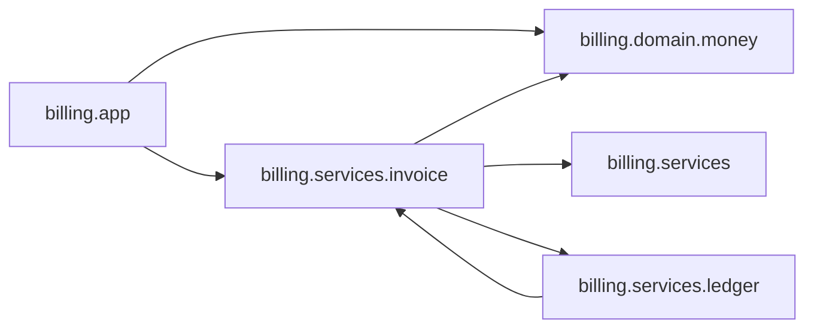

# Recipe 06 — Map your codebase

**Goal:** beyond findings, Mollify is an X-ray of your project's *structure* —
which files are heaviest, what imports what, where the complexity lives. Great
for onboarding to an unfamiliar codebase.

## Per-file metrics at a glance

```bash
cd cookbook/sample-project
mollify metrics
```

```text
Mollify metrics — .
7 file(s), 44 LOC (35 SLOC), 6 function(s); mean MI 80.9
  [A] MI  99.9  cc(max  0, sum   0)  1 sloc  billing/__init__.py
  [A] MI  56.0  cc(max  1, sum   3)  14 sloc  billing/app.py
  [A] MI  99.9  cc(max  0, sum   0)  1 sloc  billing/domain/__init__.py
  [A] MI  77.1  cc(max  1, sum   1)  3 sloc  billing/domain/money.py
  [A] MI  99.9  cc(max  0, sum   0)  1 sloc  billing/services/__init__.py
  [A] MI  57.1  cc(max  7, sum   7)  12 sloc  billing/services/invoice.py
  [A] MI  76.4  cc(max  1, sum   1)  3 sloc  billing/services/ledger.py
```

**MI** is the Maintainability Index (0–100, higher is better); **cc** is
cyclomatic complexity (max/sum per file); plus Halstead volume and raw LOC under
the hood. `invoice.py` is the obvious soft spot — lowest MI, highest complexity.

## Zoom into the hotspots

```bash
mollify complexity
```

```text
Mollify complexity — .
1 finding(s) across 7 file(s) — 0 error, 1 warn
  billing/services/invoice.py:6 [warn/certain] high-complexity — function `create_invoice` is complex (cyclomatic 7, cognitive 21); thresholds 10/15  (high-complexity:1cbe4ffa6ee8ed1d)
```

Mollify tracks **both** cyclomatic complexity (branch count) and **cognitive**
complexity (how hard it is for a human to follow — nesting hurts more than
breadth). `create_invoice`'s deeply nested `if`s spike the cognitive score to 21.
On a repo with git history, the `hotspot` rule multiplies complexity × churn to
surface the risky code that *also* changes constantly.

## See the dependency graph

Export the import graph as Mermaid (renders on GitHub) or Graphviz DOT:

```bash
mollify graph --mermaid
```



```bash
mollify graph > graph.dot          # Graphviz DOT (pipe to `dot -Tsvg`)
```

## Trace one module's neighborhood

When you're about to touch a file and want to know the blast radius:

```bash
mollify trace billing.services.invoice
```

```text
Trace — billing.services.invoice
  imports (3):
    → billing.domain.money
    → billing.services
    → billing.services.ledger
  imported by (2):
    ← billing.app
    ← billing.services.ledger
```

Three imports out, two modules depend on it — change its signature and you know
exactly who to check.

## More structural commands

```bash
mollify list                 # project topology: entry points, modules, frameworks
mollify inspect billing/app.py   # full evidence bundle for one file
mollify watch                # re-run audit on every file change (live feedback)
```

**Next:** [Recipe 07 — JSON for scripts & AI agents »](07-json-and-agents.md)
